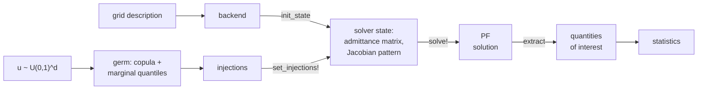

# ProbabilisticPowerFlow.jl

[](https://langestefan.github.io/ProbabilisticPowerFlow.jl/stable)
[](https://langestefan.github.io/ProbabilisticPowerFlow.jl/dev)

[](https://github.com/langestefan/ProbabilisticPowerFlow.jl/actions/workflows/Test.yml?query=branch%3Amain)
[](https://codecov.io/gh/langestefan/ProbabilisticPowerFlow.jl)
[](https://github.com/langestefan/ProbabilisticPowerFlow.jl/actions/workflows/Lint.yml?query=branch%3Amain)
[](https://github.com/langestefan/ProbabilisticPowerFlow.jl/actions/workflows/Docs.yml?query=branch%3Amain)
[](https://github.com/JuliaTesting/Aqua.jl)
[](https://github.com/aviatesk/JET.jl)

`ProbabilisticPowerFlow.jl` provides a framework for uncertainty quantification in power
flow problems.

The package is designed to be flexible and extensible, allowing users to
define their own uncertainty models, sampling methods, and solver backends. It
supports various types of uncertainty, including load variations and renewable
generation forecast errors, and can handle complex dependencies between uncertain
variables through copulas.

In a nutshell, the workflow covered by `ProbabilisticPowerFlow.jl` is:



As you can see, `ProbabilisticPowerFlow.jl` does nothing new, it just wraps existing
pieces in the Julia ecosystem together in a way that is convenient for uncertainty
quantification in power flow problems.

The solver state is built once and reused, so a sample costs one injection update and
one solve. The `d` basic random variables driving that chain are the *germ*, declared as
`GermVariable`s, each with a marginal from
[Distributions.jl](https://github.com/JuliaStats/Distributions.jl).

*The name germ comes from the uncertainty quantification literature, where the germ is
the set of variables that generates the model's probability space. Everything downstream
is a deterministic function of the germs. The copula also acts on the germs (and not on
the injections!)*

## Getting started

```julia
julia> using ProbabilisticPowerFlow, Distributions, Random, Statistics

julia> model = UncertaintyModel(
           # what is uncertain, with its marginal distribution
           [GermVariable("load3", Normal(1.1, 0.12)), GermVariable("load5", Normal(1.5, 0.18))],

           # where uncertainty lands in the network
           [Assignment("load3", ComponentRef(:load, "3", :pd)),
            Assignment("load5", ComponentRef(:load, "5", :pd))],

           # coupling between the uncertain variables, as defined by a copula
           GaussianCopula([1.0 0.5; 0.5 1.0]),
       );

julia> voltage_violation = ViolationEvent(VoltageMagnitude(5), 0.95, 1.05);

julia> prob = PPFProblem(ReferenceBackend(case5()), model, [VoltageMagnitude(5), voltage_violation]);

julia> result = solve(prob, MonteCarlo(n = 2000); rng = Xoshiro(1))
PPFResult{MonteCarlo}: 2000 of 2000 samples converged in 2000 solves
  VoltageMagnitude(5)
  ViolationEvent{VoltageMagnitude}(VoltageMagnitude(5), 0.95, 1.05)

# compute the expected voltage (mean) at bus 5
julia> mean(result, VoltageMagnitude(5))
0.9694232767171842

# lower tail: 5% of the samples fall below this voltage
julia> quantile(result, VoltageMagnitude(5), 0.05)
0.9544651904793491

# fraction of voltage samples that leaves the 0.95 to 1.05 band
julia> violation_probability(result, voltage_violation)
0.021

# any other band on a recorded quantity, read off the same samples
julia> violation_probability(result, ViolationEvent(VoltageMagnitude(5), 0.96, 1.04))
0.147
```

Diverged solves are also explicitly recorded, they are stored in `result.failures` with
the `u`-point and the injections that occurred for that solve.

## Sampling methods

Every sampling method takes as arguments `warmstart`, `keep_inputs`, and `ntasks`.

| Method           | Notes                                                                                                          |
| ---------------- | -------------------------------------------------------------------------------------------------------------- |
| `MonteCarlo`     | independent draws, mostly a reference for other methods                                                        |
| `LatinHypercube` | one draw per equal-probability bin per variable, lower variance at equal cost                                  |
| `SobolSampling`  | Sobol sequence with a random shift, unbiased and seed-reproducible                                             |
| `QMCSampling`    | any [QuasiMonteCarlo.jl](https://github.com/SciML/QuasiMonteCarlo.jl) point set, including Owen-scrambled nets |

Correlation input is Spearman by default. A Pearson target runs through the Nataf
correction with `GaussianCopula(R, variables; correlation = :pearson)`.

## Backends

`ReferenceBackend` is a dependency-free Newton solver that ships with the package and
documents the backend.

For real networks and in production, we recommend using the `PowerModelsBackend` from
[PowerModels.jl](https://github.com/lanl-ansi/PowerModels.jl) along with a solver from
[NonlinearSolve.jl](https://github.com/SciML/NonlinearSolve.jl):

```julia
using PowerModels, NonlinearSolve

data = PowerModels.parse_file("case1354_pegase.m")
backend = PowerModelsBackend(data; solver = NewtonRaphson())
result = solve(prob, MonteCarlo(n = 1000, warmstart = :chain); ntasks = 4)
```

Both settings of `solver` run the same mismatch equations, the same analytic Jacobian
and sparsity pattern, and the same `tol` and `maxiter`, so they reach the same solution.
What differs is the loop around them:

- `:nlsolve`, the default, hands the system to the bundled PowerModels routine, which
  builds a fresh NLsolve trust-region workspace for every solve.
- a NonlinearSolve algorithm builds one nonlinear cache per state at the first solve and
  reinitializes it afterwards, so the workspace and the factorization structure survive
  from sample to sample.

In practice `NonlinearSolve.jl` is typically 2 to 3 times faster than `:nlsolve` for a
single-threaded run.

## Extensions

Optional features load automatically with their trigger package.

| Extension       | Trigger package                                                     | Features                                                                 |
| --------------- | ------------------------------------------------------------------- | ------------------------------------------------------------------------ |
| PowerModels     | [`PowerModels.jl`](https://github.com/lanl-ansi/PowerModels.jl)     | Provide a `PowerModelsBackend` to import networks from `PowerModels.jl`  |
| NonlinearSolve  | [`NonlinearSolve.jl`](https://github.com/SciML/NonlinearSolve.jl)   | Faster cached solve loop, use via `solver` keyword                       |
| Copulas         | [`Copulas.jl`](https://github.com/lrnv/Copulas.jl)                  | Support any copula from `Copulas.jl` as germ dependence, tail dependence |
| Sobol           | [`Sobol.jl`](https://github.com/stevengj/Sobol.jl)                  | Support for Sobol sampling via `SobolSampling`                           |
| QuasiMonteCarlo | [`QuasiMonteCarlo.jl`](https://github.com/SciML/QuasiMonteCarlo.jl) | Support for Quasi Monte Carlo via `QMCSampling` and direct sampler input |

## How to Cite

If you use ProbabilisticPowerFlow.jl in your work, please cite using the reference given
in [CITATION.cff](https://github.com/langestefan/ProbabilisticPowerFlow.jl/blob/main/CITATION.cff).

## Contributing

If you want to make contributions of any kind, please first that a look into our [contributing guide directly on GitHub](docs/src/contributing.md) or the [contributing page on the website](https://langestefan.github.io/ProbabilisticPowerFlow.jl/dev/contributing/)
